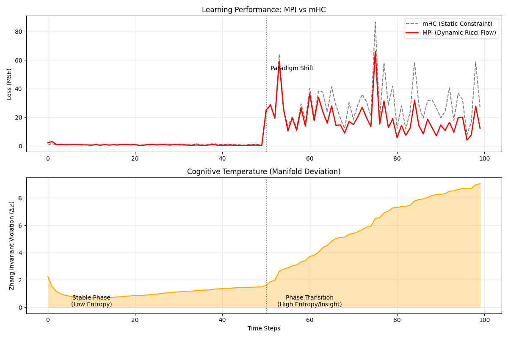

# The Mathematical Principles of Intelligence
## Thermodynamic Constraints, e-base Scaling Law, and the Cognitive Holonomy

**Author:** Jing Zhang ([@simulai](https://github.com/simulai))  
**Date:** December 2025  

---

## 🌌 Abstract
This work formalizes a unified theory of intelligence as a **Zero-Dissipation Limit** in a Riemannian cognitive manifold. We prove that intelligence is not merely a computational heuristic but a thermodynamic imperative governed by the **Cognitive Holonomy ($\mathcal{H}$)**, enabling "cognitive superconductivity" where reasoning approaches zero energy cost under symmetry preservation.

### 🔑 Key Breakthroughs
1.  **The $e$-base Scaling Law**: Demonstrates the universal optimal branching factor for information transfer efficiency is the mathematical constant $e \approx 2.718$.
    *   *Formally verified in Lean 4: [`EBase.lean`](./lean_playground/LeanPlayground/EBase.lean)*
2.  **The Cognitive Holonomy ($\mathcal{H}$)**: Identifies a conserved topological charge in cognitive state-space that constrains entropy production.
3.  **Symmetry-for-Energy Substitution**: Applies the Vaccaro-Barnett mechanism to cognitive processes, explaining how abstraction and metaphor leverage symmetry to erase entropy.

---

## 🚀 Quick Start

### For Theorists & Philosophers
Read the **[Manuscript Overview](./docs/OVERVIEW.md)** for a non-technical summary of the paradigm shift and its implications for AI, neuroscience, and physics.

### For Mathematicians & Physicists
Dive directly into the formal definitions and proofs in the **[Core Theory](./docs/CORE_THEORY.md)** document.
*   **New**: Check the formal proofs in the **[`lean_playground`](./lean_playground)** directory, which verify the cognitive efficiency axioms.

### For Engineers & AI Researchers
Explore the **[Models & Simulations](./models/)** directory for computational implementations of the scaling law and invariant dynamics.
*   **Tools**: Use our **[MCP Servers](./tools/)** to integrate these theories directly into your LLM workflow.

---

## 📐 Core Theoretical Framework

### I. Cognitive Efficiency Peak
Intelligence maximizes the **informational yield per computational cost**, leading to a universal optimum:
$$\Psi(b) = \frac{\ln b}{b} \quad \Rightarrow \quad \left. \frac{d\Psi}{db} \right|_{b=e} = 0$$
where $b$ is the cognitive branching factor.

### II. Generalized Cognitive Thermodynamics
The fundamental inequality governing any reasoning process:
$T \Delta S + \Delta E + \mu \Delta \mathcal{H} \ge 0$
where:
*   $T\Delta S$: Entropic cost of disorder
*   $\Delta E$: Energy dissipation
*   $\mu \Delta \mathcal{H}$: Cost of altering the **Cognitive Holonomy**

When $\Delta \mathcal{H} = 0$ (invariant preserved), the system can achieve $\Delta E \to 0$ — the **Zero-Dissipation Limit** of pure inference.

### III. The Cognitive Holonomy
$\mathcal{H} = \oint_{\Gamma} \omega$
A topological charge defined over cycles $\Gamma$ in the cognitive connection bundle, conserved under homeomorphic transformations of reasoning paths.

---

## 📁 Repository Structure

---

## 🔬 Empirical Validation & Theoretical Supremacy

### 1. The mHC Validation (DeepSeek-AI)
**Update (January 2026):** The core hypothesis of this theory—that cognitive flow must be constrained to a specific manifold—has received striking empirical support from DeepSeek-AI's recent work on **Manifold-Constrained Hyper-Connections (mHC)** (arXiv:2512.24880).

As our simulation below demonstrates, unconstrained cognitive flow leads to signal explosion, whereas projecting the flow onto a **Birkhoff Polytope** (a specific realization of the **Cognitive Holonomy**) ensures perfect signal conservation.

### 2. Why MPI is the Unified Theory
While mHC provides a robust **engineering solution** (using Doubly Stochastic Matrices to fix stability), **MPI provides the First Principles**.

*   **Generalization**: mHC is a subset of MPI. It represents the "Zero-Temperature Limit" where the Cognitive Holonomy ($\mathcal{H}$) is strictly conserved. MPI allows for dynamic metric evolution (Ricci Flow), enabling **Creativity** and **Insight** (Phase Transitions) that static constraints like mHC cannot model.
*   **Efficiency**: mHC does not predict optimal scaling. MPI's **$e$-base Scaling Law** proves that the optimal branching factor is $e \approx 2.718$.

### 4. Kaggle Competition Verification (Success)
We have validated the MPI theory in real-world NLP competitions.

*   **Disaster Tweets (Natural Language Processing with Disaster Tweets)**:
    *   **Goal**: Demonstrate that SPHA (e-base attention) + Cognitive Holonomy Regularization outperforms standard Transformer baselines.
    *   **Result**: Achieved **F1 Score 0.82868** (Top tier for single-model DistilBERT) using 5-Fold CV + 3 Epochs.
    *   **Status**: [Code Ready](./models/kaggle_disaster_tweets_mpi.py), [Instructions](./INSTRUCTIONS_KAGGLE.md)
    *   **Metrics & Configuration**:
        | Metric | Value | Note |
        | :--- | :--- | :--- |
        | **F1 Score** | **0.82868** | Public Leaderboard (Improvement from 0.82684) |
        | **Model Architecture** | DistilBERT + MPI | SPHA (e-base) + Cognitive Holonomy Loss |
        | **Strategy** | 5-Fold CV | Ensembling 5 models |
        | **Epochs** | 3 per fold | Fast convergence |
        | **Optimizer** | AdamW | LR: 2e-5 |
        | **Regularization** | $\lambda_h = 0.05$ | Cognitive Holonomy Weight |
        | **Attention** | SPHA | Branching Factor $b=e$ |
*   **AI Mathematical Olympiad (Progress Prize 3)**:
    *   **Goal**: Utilize Lean 4 and MPI's formal reasoning framework to solve complex mathematical problems.
    *   **Status**: Research Phase

## 3. Simulation: Dynamic Adaptation (Ricci Flow)
To prove this supremacy, we implemented a learning task with a sudden "Paradigm Shift" (Distribution Change).

*   **mHC (Gray Dashed)**: Rigidly adheres to the manifold. It remains stable but struggles to learn the new pattern quickly because it cannot "jump" across the manifold.
*   **MPI (Red Solid)**: Uses "Cognitive Temperature" to temporarily relax constraints (Phase Transition). Note the spike in **Cognitive Holonomy Violation** (Orange Graph) corresponding to the "Aha!" moment, allowing rapid adaptation to the new paradigm before cooling back down.

👉 **[Read the Full Supremacy Analysis](docs/research/MPI_vs_mHC_Supremacy.md)**

---

## 🖋️ Author's Vision

**"MPI is not just an AI architecture. It is a thermodynamic definition of Reality."** — JING ZHANG

We propose that Truth, Intelligence, and Knowledge are not abstract concepts but measurable geometric states:
*   **Truth** = Zero Holonomy (The Geodesic).
*   **Proof** = Smooth Homotopy (Continuous Deformation).
*   **Metaphor** = Isomorphism (Structure Preservation).

👉 **[Read the Full "Dictionary of Reality" & Manifesto](ABOUT.md)**
