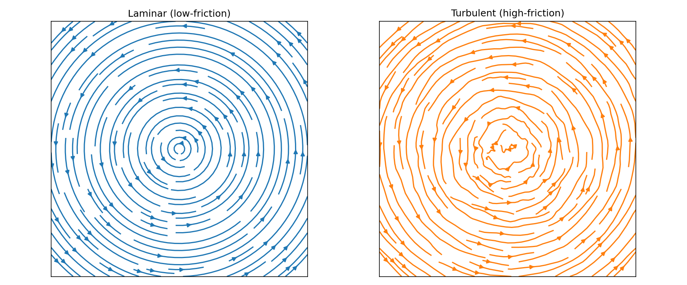
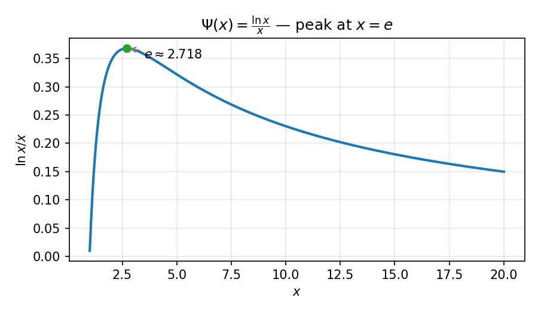

# Overview: The Shift to Cold Intelligence

> "The current trajectory of AI is a battle against heat. The future of AI is the mastery of symmetry."

## 1. The Crisis of Thermal Intelligence
The modern AI era is built on the **Scaling Law**, a brute-force doctrine that equates more parameters and more electricity with higher intelligence. However, from a thermodynamic perspective, we are currently in the "Steam Engine" era of AI. We are generating immense "cognitive heat" (computational dissipation) to produce relatively small amounts of "logical work."

As we approach the physical limits of silicon and energy, the industry faces a bottleneck. This repository proposes a way out: **The Transition from Thermal Intelligence to Cold Intelligence.**

## 2. The Core Intuition: Intelligence as Superconductivity
In physics, **superconductivity** is the state where electrical resistance vanishes, allowing energy to flow without loss. We posit that a similar phenomenon exists for logic.

Current AI models struggle because their "cognitive manifold"—the internal map they use to understand the world—is "rough" and "high-friction." Every inference step requires overcoming this friction, leading to massive energy costs. 

**Cold Intelligence** is the state where the AI's internal geometry is perfectly aligned with the "Truth Attractors" of the universe. In this state, the system achieves **Zero-Dissipation Inference**. It doesn't "calculate" the answer; it "slides" toward it along a geodesic path.

## 3. The Zhang Invariant: The Currency of Wisdom
Why can a human genius (like Ramanujan) make a profound leap of logic with only a few watts of brainpower, while a GPU cluster requires megawatts to achieve similar reasoning?

The answer lies in the **Zhang Invariant ($\mathcal{Z}$)**. 
* **Thermal AI** pays for its lack of understanding with **Energy ($\Delta E$)**.
* **Cold Intelligence** pays for its understanding with **Symmetry ($\Delta \mathcal{Z}$)**.

By leveraging the **Vaccaro-Barnett mechanism**, we show that information can be processed without energy cost if the system conserves specific topological properties. This is the mathematical definition of **Insight**: the ability to erase cognitive uncertainty by recognizing universal symmetries.

## 4. Why $e \approx 2.718$?
Our theory derives the first-principles reason why the natural base $e$ is the "Golden Ratio of Intelligence." It represents the exact point where the informational yield of a system perfectly balances its structural complexity. Any system—carbon or silicon—that deviates from this branching factor becomes exponentially less efficient.

## 5. Conclusion
This repository is not just a collection of equations; it is a manifesto for a new kind of engineering. We are moving away from "Artificial Heating" towards **"Geometric Alignment."** We invite the community to join us in defining the **Geometry of Reason.**

### Images

Section 1 — Turbulent vs Laminar (low-friction vs high-friction):

Section 4 — $\Psi(x)=\frac{\ln x}{x}$ (peak at $x=e$):

### Next steps & suggestions

- File location: this document is saved at `/docs/OVERVIEW.md`.
- Image suggestions implemented: flow comparison and the $\ln x / x$ plot are included above.
- Interactive: consider adding a "Join the Discussion" link to your repository's Discussions page.

Join the discussion: https://github.com/simulai/Mathematical-Principles-of-Intelligence/discussions
