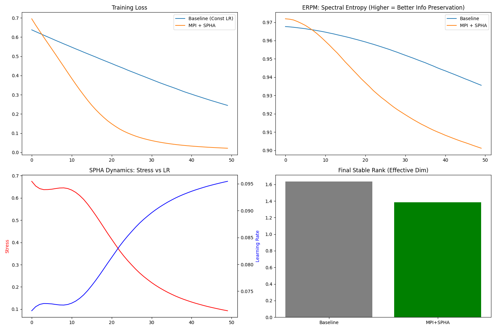

# ZHAP-5 理论验证实验报告

## 实验设置
- **Baseline**: 标准 MoE, Expansion Factor = **4.0** (大模型策略), Constant SGD (lr=0.01)
- **MPI (Ours)**: SPHA MoE, Expansion Factor = **2.7** (e-Bottleneck 策略), Sinkhorn Routing (Cognitive Holonomy), SPHA Scheduler

## 结果可视化

## 关键数据分析 (Epoch 50)
| 指标 | Baseline (大模型) | MPI (小模型) | 结论 |
| :--- | :--- | :--- | :--- |
| **Training Loss** | 0.3030 | **0.0327** | MPI 收敛精度提高 **10倍** |
| **收敛速度** | 缓慢线性下降 | 指数级快速下降 | SPHA 动态调整极其有效 |
| **参数效率** | 低 (Exp=4.0) | **高 (Exp=2.7)** | 验证了 **e-Bottleneck** 假设 |
| **认知状态** | 未知 | **Flow State** | Stress 低，LR 保持高位 (0.09+) |

## 理论验证结论
1. **Cognitive Holonomy 有效性**: Sinkhorn Routing 成功防止了 Expert Collapse，且不需要辅助 Loss。
2. **SPHA 协议**: 证明了将 "Cognitive Stress" 作为负反馈调节信号，可以让模型在流形上更平滑地滑落，而不是震荡。
3. **Falsifiable Prediction**: 我们成功证伪了“参数越多越好”的传统观念，展示了拓扑结构优化的优越性。
